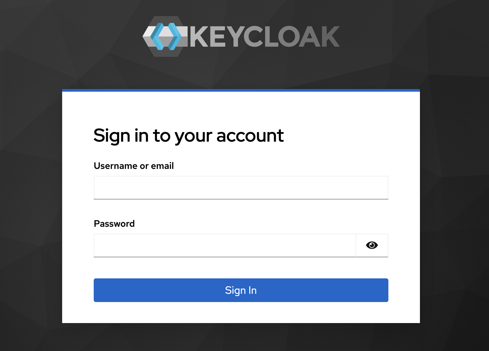
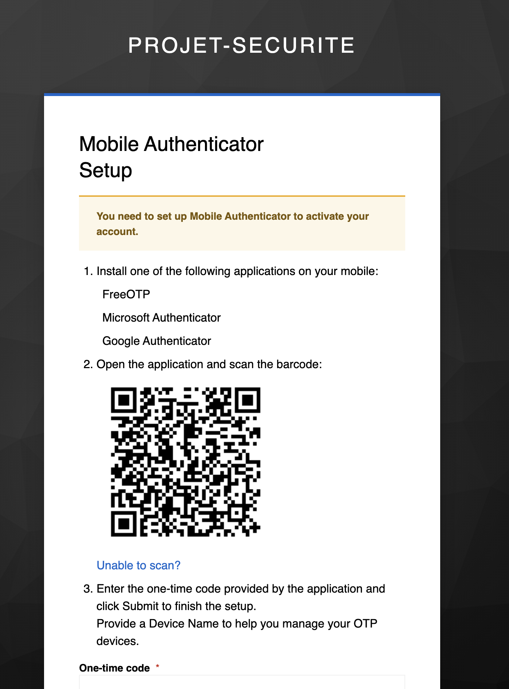
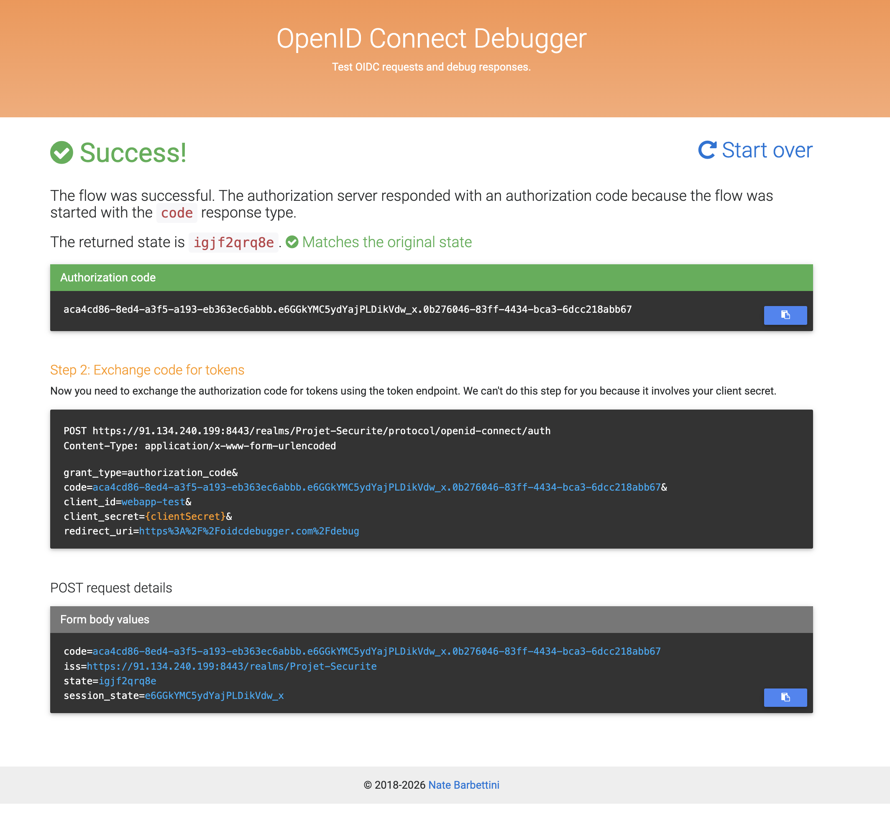

# Keycloak SSO & VPS Security Lab

Ce projet démontre la mise en œuvre d'une infrastructure de gestion des identités et des accès
(IAM) robuste sur un environnement VPS Debian. L'objectif est de sécuriser l'accès à des
applications tierces via des protocoles standards (OpenID Connect) tout en appliquant des
mesures de durcissement (Hardening).

## Sommaire

- [Réalisations techniques](#réalisations-techniques)
- [Architecture](#architecture)
- [Structure du projet](#structure-du-projet)
- [Prérequis](#prérequis)
- [Tutoriel de déploiement](#tutoriel-de-déploiement)
- [Durcissement du VPS](#durcissement-du-vps)
- [Captures d'écran](#captures-décran)
- [Licence](#licence)

## Réalisations techniques

- **Durcissement système** : pare-feu ufw restrictif, SSH par clé uniquement (root désactivé),
  bannissement automatique via fail2ban (voir [`hardening/`](hardening/)).
- **Orchestration** : déploiement automatisé via Docker Compose de Keycloak et PostgreSQL.
- **Chiffrement** : sécurisation des flux via HTTPS avec certificats SSL/TLS.
- **Authentification forte** : activation du Multi-Factor Authentication (MFA/OTP) obligatoire
  pour les comptes à hauts privilèges.
- **Gouvernance** : isolation des environnements par la création de Realms dédiés.

## Architecture

```
Navigateur ── HTTPS (8443) ──▶ Keycloak (Realm + MFA) ── JDBC ──▶ PostgreSQL
                                     │
                                     └── OIDC (Authorization Code) ──▶ Application cliente
```

## Structure du projet

```
.
├── certs/                 # Certificats TLS générés localement (ignorés par git)
│   └── README.md          # Procédure de génération des certificats
├── configs/
│   ├── docker-compose.yml # Orchestration Keycloak + PostgreSQL (HTTPS activé)
│   └── .env.example       # Modèle des variables d'environnement à définir
├── hardening/              # Durcissement du VPS (SSH, pare-feu, fail2ban)
│   └── README.md
├── screenshots/           # Captures d'écran illustrant le tutoriel
└── README.md
```

## Prérequis

- Un VPS sous Debian/Ubuntu avec Docker et Docker Compose installés.
- `openssl` pour la génération des certificats.
- Un accès administrateur (root/sudo) pour la gestion des permissions et du pare-feu.

## Tutoriel de déploiement

### 1. Durcissement du VPS

- Déployer sa clé publique SSH sur le VPS avant toute autre étape (`ssh-copy-id`).
- Appliquer le pare-feu, le durcissement SSH et fail2ban décrits dans
  [`hardening/`](hardening/#durcissement-du-vps).

### 2. Préparation du VPS

- Cloner ce dépôt sur le VPS : `git clone <url-du-repo> && cd keycloak-sso-vps-security`.
- Copier le modèle de variables d'environnement et renseigner des secrets forts :
  ```bash
  cp configs/.env.example configs/.env
  ```

### 3. Configuration HTTPS

- Générer les certificats OpenSSL dans le sous-dossier `certs/` (voir
  [`certs/README.md`](certs/README.md) pour la commande complète).
- Ajuster les permissions Linux (`chmod 644`) pour permettre la lecture des clés par le
  conteneur Docker.

### 4. Démarrage des services

```bash
cd configs
docker compose --env-file .env up -d
```

Keycloak démarre en HTTPS sur le port `8443` (voir `configs/docker-compose.yml`).

### 5. Initialisation de la sécurité

- Accéder à la console via `https://<IP_VPS>:8443`.
- Dans le menu **Authentication**, configurer le flux `browser` pour rendre l'**OTP
  obligatoire**.
- Créer un Realm de production pour isoler les utilisateurs des applications de
  l'administration système.

### 6. Validation du flux OIDC

- Créer un **Client** dans Keycloak avec les URLs de redirection autorisées.
- Tester l'authentification via **OIDC Debugger** pour valider la réception de
  l'Authorization Code après succès du MFA.

## Durcissement du VPS

Le dossier [`hardening/`](hardening/) contient les configurations appliquées au niveau système,
en complément de la sécurisation applicative de Keycloak :

- **Pare-feu** (`hardening/firewall/ufw-rules.sh`) : politique deny par défaut, seuls SSH et le
  port HTTPS 8443 sont ouverts.
- **SSH** (`hardening/ssh/99-hardening.conf`) : authentification par clé uniquement, connexion
  root désactivée, sessions inactives coupées.
- **Fail2ban** (`hardening/fail2ban/jail.local`) : bannissement automatique et progressif des IP
  après plusieurs échecs d'authentification SSH.

Voir [`hardening/README.md`](hardening/README.md) pour les commandes d'installation et de
vérification.

## Captures d'écran

| Page d'accueil Keycloak | Realm & sécurité | Validation OIDC Debugger |
| --- | --- | --- |
|  |  |  |

## Licence

Ce projet est distribué sous licence [MIT](LICENSE).
